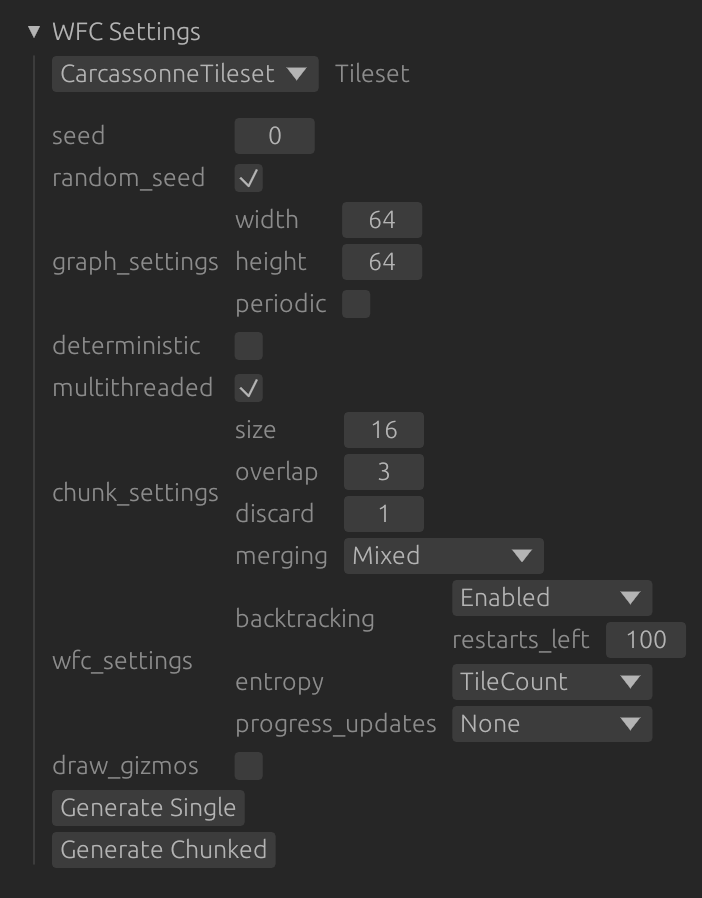
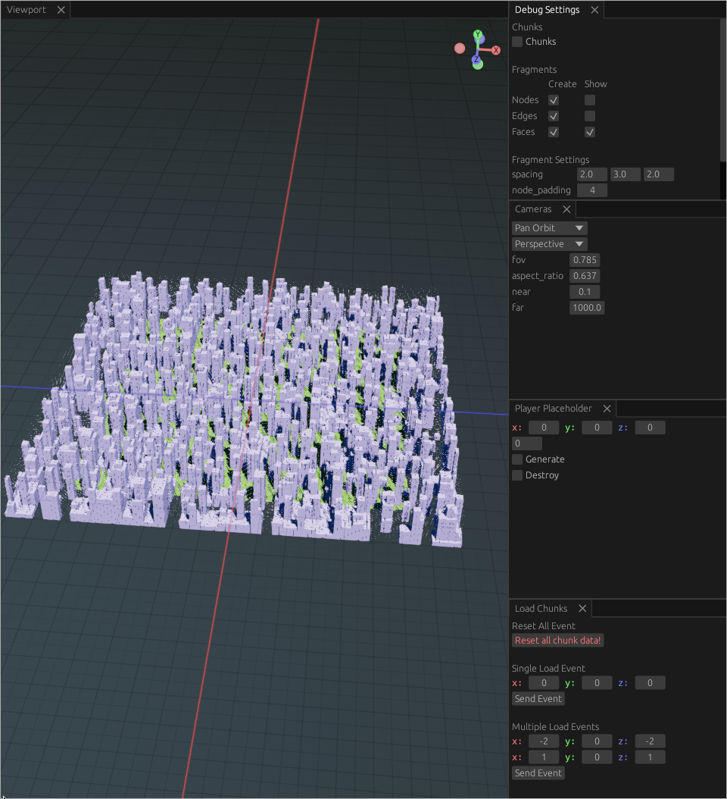
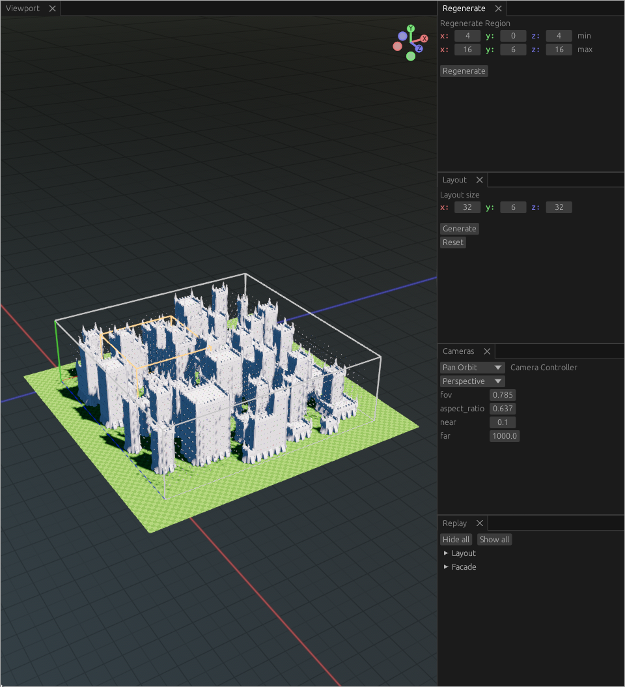

# Hierarchical WFC

Implementation of the Wave Function collapse algorithm using novel approaches to chunking, with additional preliminary research into combined Hierarchical and Semantic extensions located on the `3d` branch.

## Usage

### 2D Chunking

The 2D chunking implementation can generate outputs using both standard (`Generate Single`) and chunked generation (`Generate Chunked`) as well as options for configuring generation:

<table >
  <th>Option</th>
  <th>Description</th>

  <tr> 
    <td><code>Tileset</code></td>  
    <td> 
      The tileset used, tilesets with names of the format <code><...> x y</code> (IE: <code>Village 3 2</code>) use the overlapping model and will likely require increasing <code>chunk_settings.size</code> and <code>chunk_settings.discard</code> options to generate.
    </td> 
  </tr>
  <tr> 
    <td><code>seed</code></td> 
    <td> 
      Seed used for generation when <code>random_seed</code> is disabled.
    </td> 
  </tr>   
  <tr>
    <td><code>graph_settings</code></td> 
    <td>
      Controls for output size, <code>perodic</code> option constrains opposite edges to produce a result that can tile.
    </td>
  </tr>
  <tr>
    <td><code>deterministic</code></td> 
    <td>
      Enable variant of the chunking algorithm that is guaranteed to be deterministic.
    </td>
  </tr>
  <tr>
    <td><code>multithreaded</code></td> 
    <td>
      Use multiple threads when using chunked generation.
    </td>
  </tr>
  <tr>
    <td><code>chunk_settings.size</code></td> 
    <td> 
      Size of chunks.
    </td>
  </tr>
  <tr>
    <td><code>chunk_settings.overlap</code></td> 
    <td>
    Additional padding added to size of chunk, chunks generate and write this extra padding to the world to propagate information between chunks.
    </td>
  </tr>
  <tr>
    <td><code>chunk_settings.discard</code></td> 
    <td> 
      Extra padding added after <code>ovelap</code> that is generated but not written to the world, ensures that valid generation exists after the chunk edge.
    </td>
  </tr>
  <tr>
    <td><code>chunk_settings.merging</code></td> 
    <td>
      Approach used when extracting and merging chunks, <code>Mixed</code> is optimal, other options for debugging purposes. 
    </td>
  </tr>
  <tr>
    <td><code>wfc_settings.backtracking</code></td> 
    <td>
      Enable backtracking, the algorithm will backtrack and try different options instead of failing. <code>restarts_left</code> sets the maximum number of times the algorithm can backtrack. Change which heuristic is used when backtracking with the <code>heuristics</code> field.
    </td>
  </tr>
  <tr>
    <td><code>wfc_settings.entropy</code></td> 
    <td>
      Method used to calculate tile entropy when choosing which cell to collapse. When using tilesets with weights <code>Shannon</code> should be prefered, <code>TileCount</code> is fastest.
    </td>
  </tr>
  <tr>
    <td><code>wfc_settings.progress_updates</code></td> 
    <td>
      Set to <code>Some</code> with a timeout (such as <code>0.05</code> seconds) to show the generation progress live. Useful for visulising backtracking.
    </td>
  </tr>
  <tr>
    <td><code>wfc_settings.timeout</code></td> 
    <td>
      Optional timeout, generation fails after this time is elapsed.
    </td>
  </tr>
  <tr>
    <td><code>draw_gizmos</code></td> 
    <td>
      Show debbuging gizmos such as chunk boundaries. 
    </td>
  </tr>
</table>



### 3D Hierarchical Prototypes

Both `multipass` and `chunking` are built using the same components, for 3D navigation:

- Orbit: `Mouse3` or `Alt + Mouse1`
- Pan: `Shift + Mouse3` or `Shift + Alt + Mouse1`
  The UI panels on the right are used to expose settings for each prototype.

For `multipass` prototype:

- The `Layout` panel contains controls to start generation and change output size.
- The `Regenerate Region` panel can select and regenerate a region.
- The `Replay` panel can be used to view a replay of the generation order. Start by hiding all and expanding and replaying a pass.

For the `chunking` prototype:

- The `Debug Settings` panel controls what parts of the output are generated and shown.
- When focused, the `Player Placeholder` will show a draggable gizmo that loads and unload chunks in the specified radius. Similar to how a player might load chunks in a real game.
- The `Load Chunks` can send events to manually load chunks, groups of chunks, or reset the world.




## Compiling and Running

To compile and run first install [rust](https://www.rust-lang.org/tools/install).

The 2D implementation of WFC with our chunking approaches can be built and run with:

```bash
$ cargo run --release
```

The 3D prototypes located on the `3d` branch can be built and run with:

```bash
$ cargo run --bin multipass --release
$ cargo run --bin chunking --release
```

Development was done on the nightly channel and tested with `rustc 1.75.0-nightly (bf9a1c8a1 2023-10-08)`

To switch rust to the nightly toolchain use:

```bash
$ rustup default nightly
```

## Benchmarks

The `main` branch of the repo contains benchmarks located in the `benches` folder, python data processing code, raw data (`benches/data`), and figures (`benches/output`). To run the benchmarks, first install [rust](https://www.rust-lang.org/tools/install), then the benchmarks can be run from the root directory of the project with:

```bash
cargo bench --bench stats
cargo bench --bench chunking
cargo bench --bench failure_rate
cargo bench --bench backtracking
```

| Benchmark      | Description                                                   |
| -------------- | ------------------------------------------------------------- |
| `stats`        | Test for biases when using chunking.                          |
| `chunking`     | Performance of chunking vs standard WFC.                      |
| `failure_rate` | Tests the failure rate of different chunking methods.         |
| `backtracking` | Evaluates the performance of various backtracking heuristics. |
