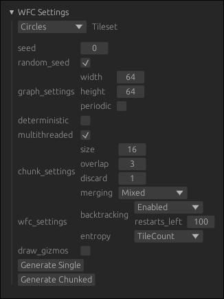

# Hierarchical WFC

Implementation of the Wave Function collapse algorithm using novel approaches to chunking, with additional preliminary research into combined Hierarchical and Semantic extensions located on the `3d` branch.

## Usage

The 2D chunking implementation can generate outputs using both standard (`Generate Single`) and chunked generation (`Generate Chunked`) as well as options for configuring generation:

<table >
  <th>Option</th>
  <th>Description</th>

  <tr> 
    <td><code>Tileset</code></td>  
    <td> 
      The tileset used, tilesets with names of the format <code><...> x y</code>(IE: <code>Village 3 2`) use the overlapping model and will likely require increasing <code>chunk_settings.size</code>and <code>chunk_settings.discard</code>options to generate.
    </td> 
  </tr>
  <tr> 
    <td><code>seed</code></td> 
    <td> 
      Seed used for generation when <code>random_seed</code>is disabled.
    </td> 
  </tr>   
  <tr>
    <td><code>graph_settings</code></td> 
    <td>
      Controls for output size, <code>perodic</code>option constrains opposite edges to produce a result that can tile.
    </td>
  </tr>
  <tr>
    <td><code>deterministic</code></td> 
    <td>
      Enable variant of the chunking algorZithm that is guaranteed to be deterministic.
    </td>
  </tr>
  <tr>
    <td><code>multithreaded</code></td> 
    <td>
      Use multiple threads when using chunked generation.
    </td>
  </tr>
  <tr>
    <td><code>chunk_settings.size</code></td> 
    <td> 
      Size of chunks
    </td>
  </tr>
  <tr>
    <td><code>chunk_settings.overlap</code></td> 
    <td>
    Additional padding added to size of chunk, chunks generate and write this extra padding to the world to propagate information between chunks.
    </td>
  </tr>
  <tr>
    <td><code>chunk_settings.discard</code></td> 
    <td> 
      Extra padding added after <code>ovelap</code>that is generated but not written to the world, ensures that valid generation exists after the chunk edge.
    </td>
  </tr>
  <tr>
    <td><code>chunk_settings.merging</code></td> 
    <td>
      ???
    </td>
  </tr>
    <tr>
    <td><code>wfc_settings.backtracking</code></td> 
    <td>
      Enable backtracking, the algorithm will backtrack and try different options instead of failing. <code>restarts_left</code>sets the maximum number of times the algorithm can backtrack. 
    </td>
  </tr>
  </tr>
    <tr>
    <td><code>wfc_settings.entropy</code></td> 
    <td>
      Method used to calculate tile entropy when choosing which cell to collapse. When using tilesets with weights <code>Shannon</code> should be prefered, <code>TileCount</code> is fastest.
    </td>
  </tr>
  </tr>
    <tr>
    <td><code>draw_gizmos</code></td> 
    <td>
      Show debbuging gizmos such as chunk boundaries. 
    </td>
  </tr>
</table>



## Compiling and Running

The 2D implementation of WFC with our chunking approaches can be built and run with:

```bash
$ cargo run --example 2d --release
```

Development was done on the nightly channel and tested with `rustc 1.75.0-nightly (bf9a1c8a1 2023-10-08)`

To switch rust to the nightly toolchain use:

```bash
$ rustup default nightly
```

## Existing Research

- [Hierarchical Semantic Wave Function Collapse](https://dl.acm.org/doi/pdf/10.1145/3582437.3587209)
- [Hierarchical Version of the Wave Function Collapse Algorithm](https://dspace.cuni.cz/handle/20.500.11956/181572)
- [Parallel Wave Function Collapse](https://amylh.github.io/WaveCollapseGen/texts/wfc-report.pdf)
